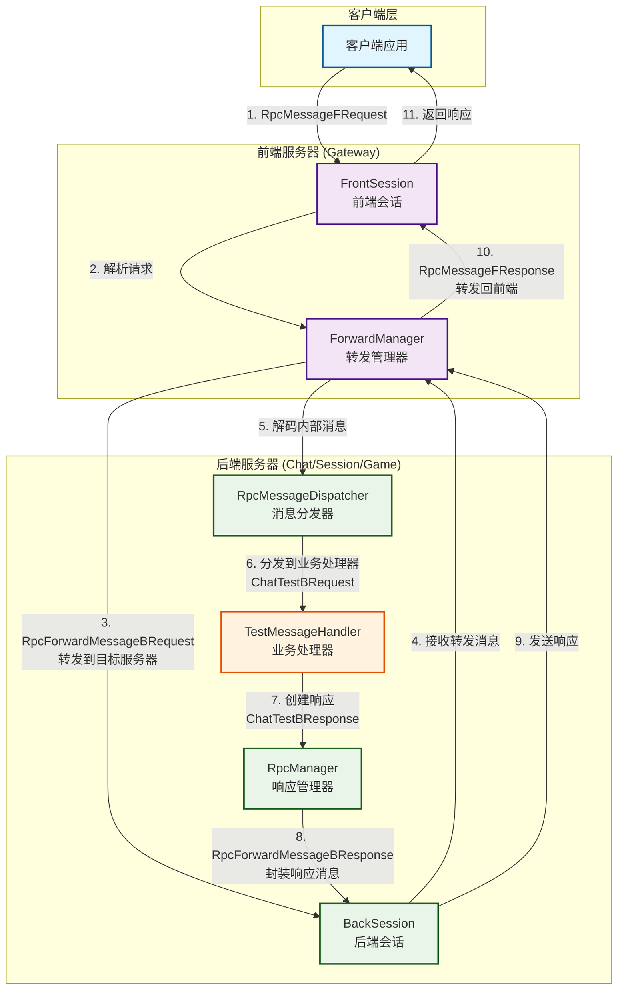
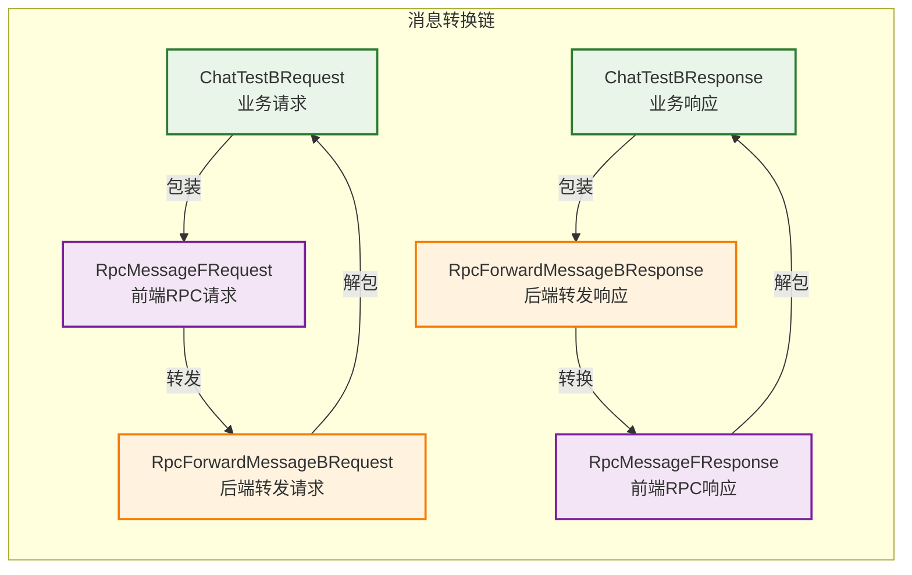

# Pantyhose Server - Rust版本

高性能分布式游戏服务器框架，采用Rust语言实现。**采用新一代RPC消息系统 + 无状态消息处理器架构**，支持完整的RPC调用链路和统一的消息类型管理。

## 核心特性

- **单线程异步架构**：基于Tokio的高性能异步I/O，主线程单线程执行
- **新一代RPC系统**：完整的RPC调用链路，支持前端→后端→业务处理→响应回传
- **统一消息类型**：msg_unique_id全链路u32类型一致性，避免类型转换问题
- **无状态消息处理**：函数式消息处理器设计，避免锁竞争
- **多协议支持**：同时支持TCP和WebSocket连接
- **智能消息分发**：RpcMessageDispatcher高效分发到业务处理器
- **调试工具支持**：内置Tauri调试工具，支持RPC消息解析和实时监控

## 架构设计

### ⚠️ 重要：单线程架构约束

**本服务器的主线程采用单线程设计，这是核心架构约束，请勿随意修改！**

- **主线程单线程执行**：所有业务逻辑、配置管理、错误处理都在主线程中串行执行
- **日志系统设计**：基于主线程单线程假设，使用 `tracing-appender` 的 `non_blocking` 模式将I/O操作委托给后台线程
- **LogGuard生命周期**：Server结构体中的 `_log_guard` 字段必须保持存活，用于维持后台日志线程的生命周期
- **无互斥锁设计**：由于主线程单线程特性，日志写入无需使用Mutex等同步原语

### 无状态消息处理器架构

**消息处理器采用无状态设计，避免竞争条件和锁开销：**

- **MsgProcessor Trait**：纯函数式接口，所有方法使用 `&self`，无状态操作
- **ProtobufMsgProcessor**：继承 MsgProcessor，专门处理 Protobuf 消息格式
- **无锁共享**：使用 `Arc<dyn MsgProcessor>` 实现多点共享，无需 Mutex
- **层次调用**：外部调用 `MsgProcessor`，内部调用 `ProtobufMsgProcessor` 方法

```rust
// 消息处理器架构
Server::msg_processor: Arc<dyn MsgProcessor>  // 服务器持有处理器实例
    ↓ (共享引用)
SessionManager::msg_processor: Option<Arc<dyn MsgProcessor>>  // Session Manager 持有引用
    ↓ (在创建session时)  
Connection::msg_processor: Option<Arc<dyn MsgProcessor>>  // Connection 获得处理器
```

### 为什么采用单线程设计？

1. **简化并发模型**：避免复杂的锁竞争和数据竞争问题
2. **提高性能**：减少线程切换和同步开销
3. **易于调试**：单线程执行路径更容易追踪和调试
4. **内存安全**：降低并发访问导致的内存安全风险

### 日志系统架构

```rust
// 主线程：业务逻辑 + 日志调用
main_thread -> tracing::info!() -> non_blocking_writer -> 后台日志线程

// LogGuard确保后台线程生命周期
Server {
    _log_guard: Option<LogGuard>, // 必须保持存活
}
```

## 项目结构

```
src/
├── framework/                    # 核心框架
│   ├── config/                   # 配置管理系统
│   │   ├── config.rs            # 配置文件解析
│   │   └── server_config_manager.rs # 服务器配置管理
│   ├── log/                      # 日志系统 (单线程 + 后台I/O)
│   ├── msg/                      # 🆕 消息处理器系统 (无状态设计)
│   │   ├── msg_processor.rs     # MsgProcessor trait 定义
│   │   └── protobuf_msg_processor.rs # Protobuf消息处理器实现
│   ├── network/                  # 网络引擎
│   │   ├── connection/           # 连接管理
│   │   │   ├── connection.rs    # Connection trait 定义
│   │   │   ├── tcp_connection.rs # TCP连接实现
│   │   │   ├── websocket_connection.rs # WebSocket连接实现
│   │   │   └── tcp_client.rs    # TCP客户端连接
│   │   ├── network_engine.rs    # 网络引擎核心
│   │   ├── tcp_server.rs        # TCP服务器
│   │   └── websocket_server.rs  # WebSocket服务器
│   ├── session/                  # 会话管理
│   │   ├── front_session.rs     # 前端会话
│   │   ├── front_session_meta_data.rs # 前端会话元数据
│   │   ├── back_session.rs      # 后端会话
│   │   ├── front_session_group.rs # 前端会话组
│   │   └── *_manager.rs         # 各种会话管理器
│   ├── rpc/                      # 🔥 RPC消息系统 (新版本)
│   │   ├── router_manager.rs    # 路由管理器
│   │   ├── rpc_manager.rs       # RPC管理器 (带响应转发接口)
│   │   ├── rpc_message_dispatcher.rs # RPC消息分发器 (u16消息ID)
│   │   └── forward_manager.rs   # RPC消息转发管理器
│   ├── cluster/                  # 集群管理
│   │   └── cluster_manager.rs   # 集群管理器
│   ├── master/                   # 主控服务器
│   │   └── master_server.rs     # 主控服务器实现
│   ├── data/                     # 数据处理
│   │   ├── dynamic_buffer.rs    # 动态缓冲区
│   │   └── event.rs             # 事件系统
│   └── server.rs                # 服务器基础类
├── servers/                      # 具体服务器实现
│   ├── chat/                     # 聊天服务器
│   │   ├── chat_server.rs       # 聊天服务器实现
│   │   └── test_message_handler.rs # 测试消息处理器 (RPC示例)
│   └── session/                  # 会话服务器
│       └── session_server.rs    # 会话服务器实现
├── proto/                        # 消息协议
│   └── messages/                 # 消息定义
│       └── protobuf/            # Protobuf消息
│           └── message/         # 自动生成的消息代码
├── tools/                        # 🆕 开发工具
│   ├── proto/                   # Protocol Buffer工具
│   │   ├── config/              # Proto定义文件 (.proto)
│   │   └── protoIdTool/         # 消息ID生成工具
│   └── pantyhose_server_tools/  # 🔥 服务器调试工具 (Tauri)
│       └── src/utils/           # 消息转换和协议管理工具
└── main.rs                       # 程序入口
```

## 编译和运行

```bash
# 编译
cargo build

# 运行服务器 (默认配置文件: bin/config.xml, 默认服务器ID: 1)
cargo run

# 指定配置文件和服务器ID运行
cargo run -- <config_path> <server_id>

# 示例：运行ID为2的聊天服务器
cargo run -- bin/config.xml 2
```

## 服务器类型

项目采用**函数式路由系统**，支持动态扩展的服务器类型：

### 动态服务器类型支持
- **无限扩展**: 通过 `RouterFunction` 支持任意服务器类型
- **智能路由**: 基于 `FrontSessionMetaData` 进行服务器选择
- **函数式设计**: 每个服务器类型可定义专用路由逻辑

### 内置服务器类型示例
- **Chat Server (聊天服务器)**: 处理聊天消息和用户交互
- **Session Server (会话服务器)**: 管理用户会话和连接状态  
- **Master Server (主控服务器)**: 集群管理和服务器协调
- **可扩展**: 通过注册 `RouterFunction` 添加新的服务器类型

服务器类型通过 `RpcManager.add_router()` 动态注册，支持运行时扩展。

## 核心功能特性

### 网络架构
- **多协议支持**: TCP、WebSocket服务器实现
- **异步网络引擎**: 基于Tokio的高性能异步网络处理
- **连接管理**: 前端/后端会话分离管理

### RPC消息系统 (新版本) 🔥
- **完整RPC流程**: 支持前端请求→后端转发→业务处理→响应回传的完整链路
- **统一消息ID**: 所有RPC消息ID使用u32类型，避免类型转换问题
- **消息分发器**: RpcMessageDispatcher支持u16消息ID映射，高效分发到业务处理器
- **响应转发接口**: RpcManager提供统一的响应转发接口，简化业务代码
- **ForwardManager**: 专门处理RPC消息的转发和路由逻辑
- **类型一致性**: msg_unique_id在整个系统中保持u32类型一致性
- **动态路由**: 支持任意数量的服务器类型，使用RouterFunction实现可扩展路由

### 会话系统
- **前端会话管理**: 处理客户端连接和通信
- **会话元数据**: `FrontSessionMetaData` 支持服务器路由映射
- **后端会话管理**: 处理服务器间通信，支持 server_type 标识
- **会话组管理**: 支持会话分组和广播功能
- **脏数据管理**: 优化数据同步和更新机制

### 集群支持
- **集群管理器**: 支持多服务器集群部署
- **主控服务器**: 统一管理和协调集群节点
- **服务发现**: 动态发现和管理集群中的服务器

### 错误处理

项目使用简化的错误处理模式：
- 函数返回 `bool` 表示成功/失败状态
- 错误详情通过 `tracing::error!` 记录到日志
- 保持代码简洁，避免复杂的错误传播链

## 主要依赖项

### 核心运行时
- `tokio`: 异步运行时框架 (单线程模式)
- `futures`: 异步编程工具集
- `futures-util`: 异步工具扩展

### 网络通信
- `tokio-tungstenite`: 异步WebSocket实现
- `tungstenite`: WebSocket协议支持
- `bytes`: 高效字节缓冲区操作

### 日志系统
- `tracing`: 结构化日志追踪框架
- `tracing-subscriber`: 日志订阅器和格式化
- `tracing-appender`: 非阻塞文件日志写入

### 数据序列化
- `serde`: 序列化/反序列化框架
- `prost`: Protocol Buffers实现（真正的protobuf二进制格式）
- `prost-build`: Protobuf代码生成器
- `protoc-bin-vendored`: 内置protoc编译器
- `quick-xml`: XML解析和序列化
- `chrono`: 日期时间处理
- `clap`: 命令行参数解析（protoIdTool）
- `anyhow`: 错误处理（protoIdTool）

## ⚠️ 开发注意事项

### 架构约束
1. **禁止破坏单线程约束**：主逻辑使用 `#[tokio::main(flavor = "current_thread")]`，不要引入多线程机制
2. **保持LogGuard存活**：`Server._log_guard` 字段维持日志后台线程生命周期，不可删除
3. **服务器初始化顺序**：严格按照 `init()` -> `lateInit()` -> `run()` -> `dispose()` 的顺序执行

### 编程规范
4. **错误处理模式**：函数返回 `bool` + `tracing::error!` 记录详情
5. **日志调用**：使用 `tracing` 宏，后台线程自动处理I/O操作
6. **配置管理**：通过 `ServerConfigManager` 统一管理服务器配置
7. **网络组件**：使用 `NetworkEngine` 统一管理网络连接和通信

### 扩展开发
8. **新增服务器类型**：使用 `add_router()` 动态注册 `RouterFunction`，无需修改源码
9. **自定义路由逻辑**：实现 `RouterFunction` 提供服务器类型专用的路由算法
10. **会话管理**：前端/后端会话分离，支持元数据和服务器类型标识
11. **集群功能**：通过 `ClusterManager` 处理服务器间通信
12. **Protocol Buffer消息**：
    - 在 `tools/proto/config/` 目录添加 `.proto` 文件
    - 使用proto3语法，支持标准protobuf特性
    - 运行 `tools/shell/generate_protobuf_message_id.cmd` 生成代码
    - 生成的消息与C#、JS等其他语言完全兼容
    - 所有消息自动实现 `MessageIdSerialize` trait

## 快速开始

### 1. 项目设置
```bash
# 克隆项目
git clone <repository_url>
cd pantyhose_server_rust2

# 编译项目
cargo build
```

### 2. 配置文件准备
确保 `bin/config.xml` 配置文件存在，包含服务器配置信息。

### 3. 运行不同类型服务器
```bash
# 运行聊天服务器
cargo run -- bin/config.xml <chat_server_id>

# 运行会话服务器  
cargo run -- bin/config.xml <session_server_id>

# 运行主控服务器
cargo run -- bin/config.xml <master_server_id>
```

## RPC消息系统详解 🔥

### 新版RPC架构设计

新版RPC系统采用分层架构，实现完整的消息转发和处理流程：



### RPC消息流转详细说明

#### 📨 请求阶段 (1-6步)
1. **客户端发起请求**: 发送`RpcMessageFRequest`到前端服务器
2. **前端解析**: `FrontSession`接收请求，交给`ForwardManager`处理
3. **请求转发**: `ForwardManager`将请求包装为`RpcForwardMessageBRequest`，根据`server_type`路由到目标后端服务器
4. **后端接收**: `BackSession`接收转发请求，再次交给`ForwardManager`
5. **消息解码**: `ForwardManager`解码内部消息，提取出真正的业务消息
6. **业务分发**: `RpcMessageDispatcher`根据消息ID将业务消息分发到对应的处理器

#### 📤 响应阶段 (7-11步) 
7. **业务处理**: `TestMessageHandler`处理业务逻辑，生成响应消息
8. **响应封装**: 通过`RpcManager`将响应消息封装为`RpcForwardMessageBResponse`
9. **响应发送**: `BackSession`发送封装后的响应消息
10. **响应转发**: `ForwardManager`将后端响应转换为`RpcMessageFResponse`
11. **客户端接收**: `FrontSession`将最终响应发送给客户端

### 消息类型对应关系



### 核心组件

1. **ForwardManager**: RPC消息转发管理器
   - 处理前端RPC请求，转发到后端服务器
   - 处理后端RPC响应，转发回前端客户端
   - 消息解码和分发到业务处理器

2. **RpcMessageDispatcher**: RPC消息分发器
   - 维护消息ID到处理器的映射 (HashMap<u16, Handler>)
   - 支持请求和通知两种消息类型
   - 高效分发消息到对应的业务处理器

3. **RpcManager**: RPC管理器
   - 提供统一的响应转发接口
   - 封装响应消息的序列化和发送逻辑
   - 支持路由功能和服务器类型管理

### 消息类型一致性

系统中各种消息ID类型的统一规范：

```rust
// Protobuf消息层: u32 (协议定义)
pub struct RpcForwardMessageBRequest {
    pub msg_unique_id: u32,  // 消息唯一ID
    pub msg_id: u32,         // 内部消息ID
}

// RPC处理层: u32 (保持一致)
pub type RpcRequestHandler = Box<dyn Fn(&mut BackSession, u32, u64, u32, &dyn Any)>;
//                                                        ^^^ msg_unique_id

// 消息分发器: u16 (优化存储)
pub struct RpcMessageDispatcher {
    request_handlers: HashMap<u16, RpcRequestHandler>,  // u16 -> Handler映射
}
```

### 业务处理器示例

```rust
// TestMessageHandler - 聊天测试处理器
impl TestMessageHandler {
    pub fn init(&mut self, dispatcher: &mut RpcMessageDispatcher, rpc_manager: &mut RpcManager) {
        // 保存RpcManager引用
        self.rpc_manager = rpc_manager as *mut RpcManager;
        
        // 注册消息处理器
        dispatcher.register_request_handler(
            MSG_ID_CHAT_TEST_B_REQUEST,
            Box::new(|session, msg_unique_id, front_session_id, msg_id, message| {
                Self::handle_test_request_static(session, msg_unique_id, front_session_id, msg_id, message);
            }),
        );
    }
    
    // 处理聊天测试请求
    pub fn handle_test_request_static(
        session: &mut BackSession,
        msg_unique_id: u32,
        front_session_id: u64,
        msg_id: u32,
        message: &dyn Any
    ) {
        if let Some(request) = message.downcast_ref::<ChatTestBRequest>() {
            // 创建响应
            let response = ChatTestBResponse {
                content: format!("Echo from chat server: {}", request.content),
            };
            
            // 发送响应 (自动封装为RpcForwardMessageBResponse)
            let rpc_response = RpcForwardMessageBResponse {
                msg_unique_id,
                front_session_id,
                meta: HashMap::new(),
                msg_id: MSG_ID_CHAT_TEST_B_RESPONSE as u32,
                message: response.serialize_to_buffer().unwrap().to_vec(),
            };
            
            session.send_message(rpc_response);
        }
    }
}
```

### RPC调用流程

1. **前端请求** (RpcMessageFRequest)
   ```
   客户端 → FrontSession → ForwardManager::handle_rpc_message_request
   ```

2. **后端转发** (RpcForwardMessageBRequest)
   ```
   ForwardManager → BackSession → ForwardManager::handle_rpc_forward_message_request
   ```

3. **业务处理**
   ```
   ForwardManager → RpcMessageDispatcher → TestMessageHandler::handle_test_request_static
   ```

4. **响应回传** (RpcForwardMessageBResponse)
   ```
   业务处理器 → BackSession → ForwardManager::handle_rpc_forward_message_response
   ```

5. **前端响应** (RpcMessageFResponse)
   ```
   ForwardManager → FrontSession → 客户端
   ```

### 类型转换策略

为了保持系统的类型一致性，采用以下转换策略：

- **网络协议层**: 使用u32 (Protobuf定义)
- **内部处理层**: 使用u32 (避免类型转换)
- **存储优化层**: 使用u16 (HashMap键类型，节省内存)
- **消息工厂层**: 使用u16 (MessageFactory接口要求)

```rust
// 类型转换点
MessageFactory::decode_message(msg_id as u16, buffer, length)  // u32 -> u16
dispatcher.dispatch_request_message(msg_id as u16, session, msg_unique_id, ...)  // u32 -> u16
```

## 配置文件说明

### 基本配置结构（config.xml）
```xml
<?xml version="1.0" encoding="UTF-8"?>
<config>
    <!-- 运行时配置 -->
    <run_time worker_threads="4"/>
    
    <!-- 服务器配置 -->
    <servers>
        <group name="master">
            <server id="1" back_tcp_port="3000"/>
        </group>
        
        <group name="chat">
            <server id="11" back_tcp_port="3101" front_tcp_port="3001" front_ws_port="3011"/>
            <server id="12" back_tcp_port="3102" front_tcp_port="3002" front_ws_port="3012"/>
        </group>
        
        <group name="session">
            <server id="21" back_tcp_port="3201" front_tcp_port="3202" front_ws_port="3212"/>
        </group>
    </servers>

    <!-- 日志配置 -->
    <log debug="terminal|file"
         info="terminal|file"
         net="terminal|file"
         warn="terminal|file"
         err="terminal|file"/>
</config>
```

### 配置项说明
- **worker_threads**: Tokio运行时的工作线程数
- **back_tcp_port**: 后端服务器间通信端口
- **front_tcp_port**: 前端TCP客户端连接端口
- **front_ws_port**: 前端WebSocket客户端连接端口
- **log**: 日志输出配置，支持terminal（终端）和file（文件）输出

## 定时器系统

项目内置高效的定时器管理系统：

- **基于最小堆实现**：O(log n)的插入和删除操作
- **支持延迟和重复执行**：可配置延迟时间和重复次数
- **回调函数机制**：支持闭包回调，灵活处理定时任务
- **纳秒级精度**：使用u64存储时间戳，支持高精度定时

### 使用示例
```rust
// 创建一次性定时器
let timer = Timer::new(
    timer_id,
    1000, // 延迟1秒
    1,    // 执行1次
    now,
    Box::new(|| {
        println!("Timer triggered!");
    })
);

// 创建重复定时器
let repeating_timer = Timer::new(
    timer_id,
    500,  // 每500ms触发
    10,   // 重复10次
    now,
    Box::new(|| {
        println!("Repeating timer triggered!");
    })
);
```

## Protocol Buffer 消息系统 🆕

### 消息格式
项目采用标准Protocol Buffers二进制格式，带自定义消息头：
```
[Message ID (u16)] [Length (u16/u32)] [Protobuf Binary Data]
```
- **Message ID**: 2字节，大端序
- **Length**: 2或4字节（可配置），大端序
- **Data**: 标准protobuf二进制格式

### 真正的Protobuf支持
- 使用 **prost** 库生成标准protobuf消息
- 与其他语言（C#、JavaScript、Python等）完全兼容
- 支持proto3语法和所有protobuf特性
- 消息使用 `prost::Message` trait进行编解码

### 消息ID分配规则
消息ID基于消息名称后缀自动分配：
- **Request/Response/Notify**: 自动递增分配ID
- **统一管理**: 所有消息ID在 `protobuf_message_id.rs` 中定义

### MessageIdSerialize Trait
所有Protobuf消息自动实现 `MessageIdSerialize` trait：
```rust
pub trait MessageId {
    fn msg_id(&self) -> u16;
}

pub trait MessageIdSerialize: MessageId + prost::Message + Default {
    fn serialize_to_buffer(&self) -> Result<BytesMut, Box<dyn std::error::Error + Send + Sync>>;
}
```

### 消息生成工具
使用 `protoIdTool` 生成消息代码和ID映射：

#### 生成消息代码
```bash
# 使用生成脚本（推荐）
tools/shell/generate_protobuf_message_id.cmd

# 或直接运行工具
tools/bin/proto-id-tool.exe --proto-path tools/proto/config --language rust --output-path src/proto/messages --length-bytes 2
```

#### 工具功能
- 使用 **prost-build** 生成标准protobuf代码
- 自动为每个消息生成唯一ID常量
- 生成 `MessageId` 和 `MessageIdSerialize` trait实现
- 生成 `MessageFactory` 用于消息解码
- 支持配置消息长度字段大小（2或4字节）

### Proto文件规范
在 `tools/proto/config/` 目录创建 `.proto` 文件：
```protobuf
syntax = "proto3";

package mypackage;

// 后端消息示例
message MyBRequest {
    uint32 msg_unique_id = 1;  // 请求ID
    string data = 2;
}

message MyBResponse {
    uint32 msg_unique_id = 1;  // 响应ID
    int32 result = 2;
}

// 前端消息示例
message MyFRequest {
    string token = 1;
}

message MyFResponse {
    bool success = 1;
}
```

### 使用示例
```rust
// 发送消息（自动序列化为protobuf二进制格式）
let message = NodeRegisterBRequest {
    msg_unique_id: 12345,
    client_token: "token".to_string(),
    server_config: Some(ServerConfig { ... }),
};
session.send_message(message);

// 接收消息（使用MessageFactory解码）
let message = MessageFactory::decode_message(msg_id, buffer, length)?;
if let Some(request) = message.downcast_ref::<NodeRegisterBRequest>() {
    // 处理消息
}
```

### 跨语言兼容性
生成的protobuf消息与其他语言完全兼容：
- **C#**: 使用Google.Protobuf库
- **JavaScript**: 使用protobufjs或google-protobuf
- **Python**: 使用protobuf库
- **Go**: 使用google.golang.org/protobuf

客户端只需使用相同的 `.proto` 文件生成对应语言的代码即可。

## 数据结构

### DynamicBuffer
动态增长的字节缓冲区，用于网络数据接收和发送：
- 自动扩容机制
- 高效的读写操作
- 支持零拷贝操作

### Event系统
事件驱动架构的核心组件：
- 支持异步事件处理
- 事件队列管理
- 事件优先级支持

### 堆数据结构
- **MinHeap**: 最小堆实现，用于定时器管理
- **MaxHeap**: 最大堆实现，用于优先级队列

## 工具支持

### 服务器调试工具 🔥
- **pantyhose_server_tools**: 基于Tauri的现代化调试工具
  - **实时消息监控**: 支持TCP和WebSocket协议的消息收发
  - **RPC消息解析**: 自动解析RpcMessageFResponse内部消息，显示真实业务数据
  - **协议管理**: 动态加载.proto文件，支持多包消息类型
  - **消息模板**: 支持自定义消息模板，快速发送测试消息
  - **类型过滤**: 根据服务器类型自动过滤可用消息类型

### 开发工具
- **proto-id-tool**: Protocol Buffer消息ID生成工具
- **generate_protobuf_message_id.cmd**: 一键生成脚本
- **message_transform.ts**: TypeScript消息转换工具 (支持RPC响应解析)

## 性能优化建议

1. **单线程设计优势**
   - 避免锁竞争，提高CPU缓存命中率
   - 简化内存模型，减少内存屏障开销
   - 便于性能分析和调试

2. **异步I/O优化**
   - 使用Tokio的异步运行时
   - 批量处理网络消息
   - 非阻塞日志写入

3. **内存管理**
   - 使用Arc进行引用计数
   - 避免频繁的内存分配
   - 复用缓冲区

## 架构扩展建议

如需修改架构，请先深入理解单线程设计的原因和约束，避免引入破坏性变更：

1. **保持单线程模型**：主线程单线程执行，异步I/O通过后台线程处理
2. **遵循现有模式**：错误处理、配置管理、网络通信都有既定模式
3. **扩展路由系统**：通过 `RouterFunction` 添加新的服务器类型支持
4. **测试验证**：重点测试日志系统、网络连接、会话管理、RPC路由的正确性
5. **渐进式改进**：新功能基于现有框架扩展，避免大范围重构

## 贡献指南

欢迎贡献代码和提出建议！在提交PR前，请确保：

1. 代码遵循项目的单线程架构约束
2. 所有测试通过
3. 代码格式符合Rust标准（使用rustfmt）
4. 添加必要的文档和注释
5. 提交信息清晰描述变更内容

## 许可证

[请在此处添加许可证信息]